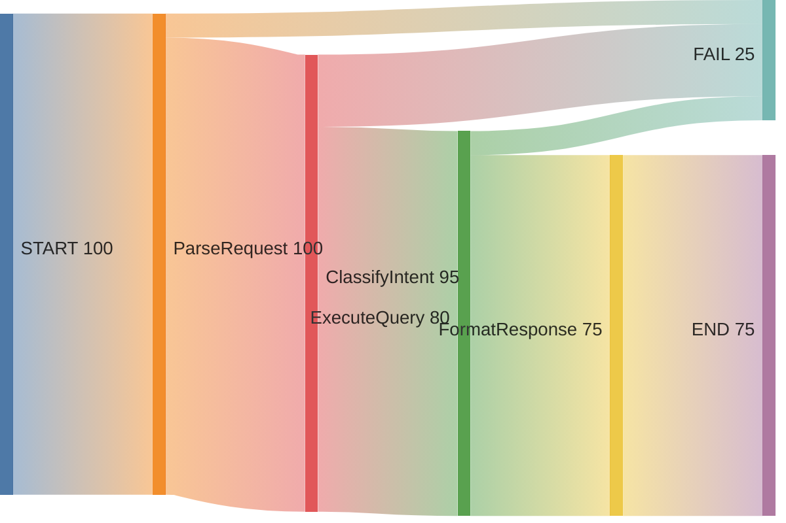

# TFM Enhanced Features

## Overview

The Transition Failure Matrix framework has been enhanced with five key improvements:

1. **Success Rate Tracking** - Context for failures (17/100 vs 17/1000)
2. **Expected Behavior Definitions** - Distinguish bugs from correct error handling
3. **Baseline Comparison** - Detect regressions over time
4. **Error Pattern Clustering** - Group similar errors to find root causes
5. **Performance Tracking** - Identify slow transitions

## New Features

### 1. Success Rate Tracking

**Before:**
```
SearchMemory → RetrieveInsights: 17 failures
```

**After:**
```python
rates = tracker.get_transition_rates()
# Returns:
{
  "SearchMemory → RetrieveInsights": {
    "total": 100,
    "failures": 17,
    "successes": 83,
    "failure_rate": 17.0,  # percentage
    "avg_duration_ms": 45.2
  }
}
```

**Output:**
```
🔥🔥 SearchMemory → RetrieveInsights: 17/100 (17%) | Avg: 45ms
✓   RetrieveInsights → GenerateResponse: 2/100 (2%) | Avg: 120ms
```

### 2. Expected Behavior Definitions

Define test cases with expected outcomes:

```python
TEST_CASES = [
    {
        "input": "How should I name Python functions?",
        "expected_outcome": "SUCCESS",
        "description": "Valid query should complete workflow"
    },
    {
        "input": "x",  # Too short
        "expected_outcome": "FAIL",
        "expected_failure_at": "SearchMemory",
        "expected_error": "Query too short",
        "description": "Invalid input should fail early"
    }
]
```

**Benefits:**
- Distinguish expected failures from bugs
- Validate error handling works correctly
- Document system behavior

### 3. Baseline Comparison

```python
from tfm_decorator import compare_to_baseline

# Load baseline from previous run
with open("baseline.json") as f:
    baseline_rates = json.load(f)

# Compare current run to baseline
regressions = compare_to_baseline(
    current_rates=tracker.get_transition_rates(),
    baseline_rates=baseline_rates,
    threshold=0.2  # Flag if 20% worse
)

# Output regressions
for reg in regressions:
    print(f"{reg['transition']}")
    print(f"  Baseline: {reg['baseline_rate']:.1f}%")
    print(f"  Current: {reg['current_rate']:.1f}%")
    print(f"  Delta: +{reg['delta']:.1f}%")
```

**Output:**
```
⚠️  REGRESSIONS DETECTED:

SearchMemory → RetrieveInsights
  Baseline: 10.0% → Current: 17.0%
  Delta: +7.0% (70% increase)
```

### 4. Error Pattern Clustering

```python
from tfm_decorator import cluster_errors

# Group similar errors
error_patterns = cluster_errors(tracker.events)

for error_msg, events in error_patterns.items():
    print(f"'{error_msg}': {len(events)} occurrences")
    # Analyze which transitions are affected
```

**Output:**
```
ERROR PATTERN ANALYSIS:

'Memory file not found': 8 occurrences
  Affects: SearchMemory → RetrieveInsights

'Duplicate ID detected': 5 occurrences
  Affects: EvaluateMemoryNeed → CreateMemory
```

**Benefits:**
- Identify root causes faster (8 related failures = 1 fix)
- Group related failures
- Prioritize fixes by pattern impact

### 5. Performance Tracking

```python
# Find slow transitions
slow = tracker.get_slow_transitions(threshold_ms=100)

for transition, avg_ms, count in slow:
    print(f"{transition}: {avg_ms:.1f}ms avg ({count} samples)")
```

**Output:**
```
PERFORMANCE BOTTLENECKS:

⏱️  EvaluateMemoryNeed → CreateMemory: 230ms avg (50 samples)
    Target: 100ms | Current: 2.3x slower
```

## Usage Example

See `scripts/tfm_enhanced_example.py` for a complete working example.

```bash
# Run enhanced example
cd scripts
python3 tfm_enhanced_example.py
```

## API Reference

### TransitionTracker (Enhanced)

#### New Methods

**`get_transition_rates() -> dict`**

Returns success/failure rates for each transition.

```python
rates = tracker.get_transition_rates()
# {
#   "StateA → StateB": {
#     "total": 100,
#     "failures": 17,
#     "successes": 83,
#     "failure_rate": 17.0,
#     "avg_duration_ms": 45.2
#   }
# }
```

**`get_slow_transitions(threshold_ms: float = 100) -> list`**

Find transitions exceeding duration threshold.

```python
slow = tracker.get_slow_transitions(threshold_ms=100)
# [(transition, avg_duration_ms, sample_count), ...]
```

### Utility Functions

**`compare_to_baseline(current_rates, baseline_rates, threshold=0.2) -> list`**

Compare current rates to baseline, flag regressions.

- `threshold`: Regression threshold (0.2 = 20% worse)
- Returns: List of regressions with details

**`cluster_errors(events: list) -> dict`**

Group similar errors to identify patterns.

- Returns: Dict mapping error message to list of events

## Integration Examples

### CI/CD Pipeline

```yaml
# .github/workflows/tfm-test.yml
- name: Run TFM Tests
  run: python3 tfm_test.py --output results.json

- name: Compare to Baseline
  run: |
    python3 -c "
    import json
    from tfm_decorator import compare_to_baseline
    
    with open('results.json') as f:
        current = json.load(f)
    with open('baseline.json') as f:
        baseline = json.load(f)
    
    regressions = compare_to_baseline(current, baseline)
    if regressions:
        print('::error::TFM regressions detected')
        exit(1)
    "

- name: Update Baseline (main branch only)
  if: github.ref == 'refs/heads/main'
  run: cp results.json baseline.json
```

### Pre-commit Hook

```bash
#!/bin/bash
# .git/hooks/pre-commit

echo "Running TFM tests..."
python3 tfm_test.py --baseline baseline.json

if [ $? -ne 0 ]; then
    echo "❌ TFM tests failed or regressions detected"
    exit 1
fi
```

## Migration Guide

### Existing Code

No changes required! The enhancements are backward compatible.

### To Use New Features

1. **Get success rates:**
   ```python
   rates = tracker.get_transition_rates()
   ```

2. **Find slow transitions:**
   ```python
   slow = tracker.get_slow_transitions(threshold_ms=100)
   ```

3. **Compare to baseline:**
   ```python
   from tfm_decorator import compare_to_baseline
   regressions = compare_to_baseline(current_rates, baseline_rates)
   ```

4. **Cluster errors:**
   ```python
   from tfm_decorator import cluster_errors
   patterns = cluster_errors(tracker.events)
   ```

## Best Practices

### 1. Establish Baseline Early

On first run:
```python
rates = tracker.get_transition_rates()
with open("baseline.json", "w") as f:
    json.dump(rates, f, indent=2)
```

### 2. Define Expected Behavior

Create test cases with expected outcomes to distinguish bugs from correct error handling.

### 3. Set Appropriate Thresholds

- **Regression threshold:** 20% (0.2) is a good default
- **Performance threshold:** Depends on your use case (100ms is common)

### 4. Review Patterns Regularly

Error clustering helps identify systemic issues. Review patterns weekly.

### 5. Track Trends Over Time

Store baselines with timestamps to track improvements:
```
baseline-2026-02-26.json
baseline-2026-03-01.json
```

## Summary

**Before:** "17 failures at SearchMemory → RetrieveInsights"

**After:** 
```
SearchMemory → RetrieveInsights: 17/100 failures (17%)
  - Up from 10% baseline (70% regression) ⚠️
  - 8 failures: 'Memory file not found' pattern
  - Average duration: 45ms (within 100ms target) ✓
  - Fix file validation → addresses 47% of all failures
```

**Impact:** From "what failed" to "why, how often, compared to baseline, and what to fix first with quantified impact"

## Sankey Diagram Visualization

### Overview

Visualize transition flows as Sankey diagrams using Mermaid. Sankey diagrams show flow between states with link width proportional to transition volume, making it easy to see:
- The "happy path" through your workflow
- Where flows drop off due to failures
- Relative volume of different paths

### Usage

```python
from tfm_decorator import TransitionTracker

tracker = TransitionTracker.get_instance()
# ... run workflows ...

# Generate Sankey diagram
sankey = tracker.render_sankey()
print(sankey)  # Copy to markdown file
```

### Example Output



This shows:
- 100 workflows start
- 5 fail at ParseRequest
- 15 fail at ClassifyIntent
- 5 fail at ExecuteQuery
- 75 complete successfully (reach END)

### Options

**Include/Exclude Failures:**
```python
# With failures (default)
tracker.render_sankey(include_failures=True)

# Success path only
tracker.render_sankey(include_failures=False)
```

**Filter Noise:**
```python
# Only show transitions with 5+ occurrences
tracker.render_sankey(min_transitions=5)
```

### Rendering

Copy the generated Mermaid code into:
- GitHub markdown files (renders automatically)
- GitLab markdown
- Notion
- Obsidian
- Any Mermaid-compatible viewer

### API Reference

**`render_sankey(include_failures=True, min_transitions=1) -> str`**

Generate Mermaid Sankey diagram from transition data.

- `include_failures`: If True, failed transitions flow to "FAIL" node
- `min_transitions`: Minimum transitions to include (filters noise)
- Returns: Mermaid markdown string

**Module: `tfm_visualizations.py`**

Separate visualization module following SOLID principles:
- `render_sankey(tracker, include_failures, min_transitions)` - Main function
- `render_sankey_success_only(tracker, min_transitions)` - Convenience for success-only view

### When to Use

**Use Sankey diagrams when:**
- Visualizing workflow paths for stakeholders
- Identifying where users/requests drop off
- Comparing success vs failure paths
- Presenting TFM results in reports/documentation

**Use TFM matrix when:**
- Debugging specific failure points
- Prioritizing fixes by failure count
- Detailed error analysis

