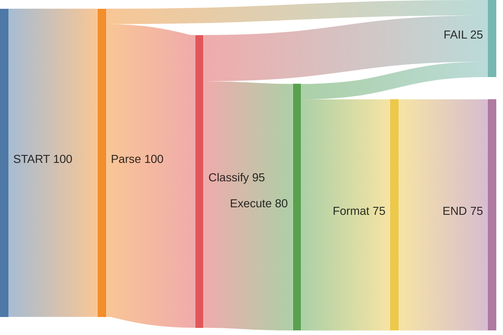

# Transition Failure Matrix

> Identify exactly where your multi-step agent workflows are failing.

## What is it?

The Transition Failure Matrix (TFM) is a debugging technique for multi-step workflows. When you have an agent or pipeline with many steps (Parse → Classify → Execute → Format), it's hard to know *which* step is failing most often.

TFM solves this by:
1. Tracking every state transition (A → B)
2. Counting failures per transition
3. Generating a matrix that shows "hotspots" — the transitions that fail most

**✨ Enhanced Features:**
- Success rate tracking (17/100 failures = 17%, not just "17 failures")
- Baseline comparison & regression detection
- Error pattern clustering
- Performance bottleneck identification
- **Sankey diagram visualization** - Visual flow diagrams in markdown
- See [ENHANCEMENTS.md](ENHANCEMENTS.md) for details

## Why use it?

**Before TFM:**
```
"My agent fails a lot but I don't know why. Is it the LLM? The API? The SQL?"
```

**After TFM:**
```
"GenSQL → ExecSQL fails 12/100 times (12% rate, up from 8% baseline).
8 failures due to 'Permission denied' pattern. Fix permissions first."
```

**Visual Flow (Sankey Diagram):**

*Shows: 100 start → 75 succeed → 25 fail at various stages*
8 failures due to 'Permission denied' pattern. Fix permissions first."
```

## Inspiration

This technique comes from [Bryan Bischof's talk at Applied AI Evals](https://bit.ly/failure-matrix), where he used transition matrices to debug complex multi-agent LLM systems.

## How it works

```
           ┌─────────────────────────────────────┐
           │         Your Workflow               │
           └─────────────────────────────────────┘
                        │
                        ▼
           ┌─────────────────────────────────────┐
           │   1. Define States                  │
           │      START → Parse → Plan → Execute │
           └─────────────────────────────────────┘
                        │
                        ▼
           ┌─────────────────────────────────────┐
           │   2. Log Transitions                │
           │      "Parse → Plan: SUCCESS"         │
           │      "Plan → Execute: FAILURE"       │
           └─────────────────────────────────────┘
                        │
                        ▼
           ┌─────────────────────────────────────┐
           │   3. Build Matrix                   │
           │      ┌────┬────┬────┬────────┐      │
           │      │    │Parse│Plan│Execute│      │
           │      ├────┼────┼────┼────────┤      │
           │      │START│ 0  │ 2  │   0    │      │
           │      │Parse│ -  │ 1  │   0    │      │
           │      │Plan │ -  │ -  │  12    │ ← HOTSPOT
           │      └────┴────┴────┴────────┘      │
           └─────────────────────────────────────┘
                        │
                        ▼
           ┌─────────────────────────────────────┐
           │   4. Fix the Hotspot                │
           │      "Plan → Execute fails 12x"     │
           │      → Investigate and fix           │
           └─────────────────────────────────────┘
```

## Quick start

Choose your implementation:

### Python (Backend/CLI)

```bash
# 1. Install - copy files to your project
cp scripts/tfm_decorator.py your_project/
cp scripts/tfm_analyze.py your_project/

# 2. Instrument your code
@track_state("ParseRequest")
async def parse_request(data):
    return parse(data)

# 3. Analyze
python scripts/tfm_analyze.py --log-file agent.log
```

### TypeScript (Browser)

```bash
# 1. Install - copy files to your project
cp typescript/transitionLogger.ts src/services/
cp typescript/analyzeTransitions.ts src/utils/

# 2. Instrument your code
logTransition({
  fromState: 'ParseRequest',
  toState: 'ClassifyIntent',
  status: 'SUCCESS',
  timestamp: Date.now(),
  framework: 'your-framework'
});

# 3. Analyze (in browser console)
analyzeTransitions()
```

## Output example

```
=== TRANSITION FAILURE MATRIX ANALYSIS ===

SUMMARY:
  Total Transitions: 847
  Successes: 802 (94.7%)
  Failures: 45 (5.3%)

🔥 FAILURE HOTSPOTS:
  GenSQL → ExecSQL: 12 failures
  DecideTool → GenSQL: 6 failures
  ExecSQL → ExecSQL: 5 failures (retry loop)

Common errors:
  GenSQL → ExecSQL:
    "Permission denied" (8x)
    "Syntax error" (3x)
    "Timeout" (1x)
```

## When to use

- **Multi-step agents:** LLM workflows with tool calling, planning, execution
- **ETL pipelines:** Extract → Transform → Load operations
- **API handlers:** Request → Auth → Process → Respond
- **Complex automation:** Any workflow with 5+ discrete steps

## When NOT to use

- **Simple 2-step processes:** Just add regular logging
- **One-off scripts:** Overkill for quick scripts
- **Performance profiling:** Use profiling tools instead

## Which implementation?

| Use Python when... | Use TypeScript when... |
|-------------------|----------------------|
| Building a backend service | Building a browser app |
| Have log files to analyze | Want in-browser analysis |
| Need CLI tooling | Using React/Vue/Svelte |
| Processing server logs | Debugging client-side workflows |

## Documentation

See [SKILL.md](SKILL.md) for:
- Step-by-step implementation guide
- Best practices and patterns
- Integration with other tools
- Troubleshooting guide

## License

MIT

---

**Created:** 2025-01-20
**Inspiration:** [Bryan Bischof - Applied AI Evals](https://bit.ly/failure-matrix)
